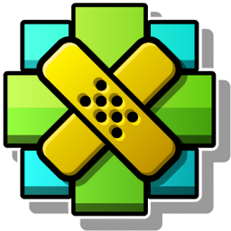

# Vanilla Fix

A Geometry Dash texture pack that aims to fix all of GD's vanilla icons with inconsistencies and any kind of low quality details, such as:

- Icons that *should* be symmetrical not being symmetrical (like some cubes being 121x120).
- Unnecessary Dithering in some icons.
- Badly made layers (glow/secondary) on icons.
- Wrongly offset parts.

## Commit Tags
On some commits to the pack you will find certain "tags", you will see texts like "[U]" or "[G]", these are meant to explain what exactly was done to the icon. Here's what each of them mean so you are aware of how progress is being done:

- [U] - Icon was Undithered.
- [G] - Stands for Glow. The icon's Glow was fixed.
- [P1] or [P2] - The icon's Primary or Secondary layer were fixed.
- [R] - Stands for Remake. The icon was remade entirely.
- [WS] - Stands for Wrong Symmetry. The icon's symmetry was fixed.
